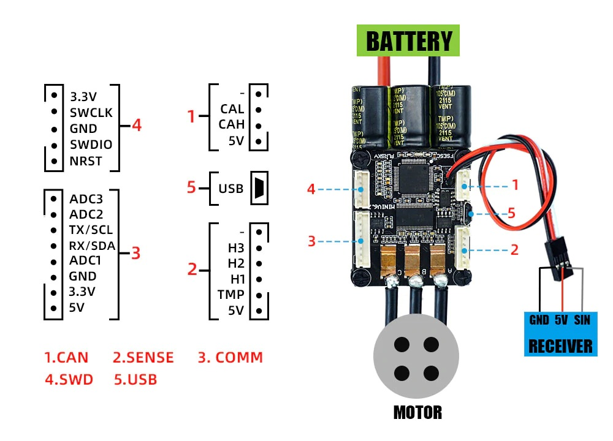

## VESC 6 with SimpleFOC - 1kW of Brushless Power

This project start from [here](https://github.com/owennewo/simplefoc_vesc) in which a VESC 4 is used

This project is develop on a FSESC mini 6.7 (clone of a VESC 6) and is tested with Arduino / PlatformIO code using [SimpleFOC](https://simplefoc.com) library.  It is tested in velocity and angle control mode.

This replaces the VESC firmware, but it can be easily recovered by using the STM32CubeProgrammer and a .bin image of the VESC firmware.

Visual Studio Code (ver. 1.65.0) and the TelePlot plugin (ver. 1.0.5) are recommended for the build and development of this project. Pay attention to the version of the two as in later versions, TelePlot stopped working and in some versions ran on Windows OS and not Linux.

In the current version of Visual Studio Code (ver. 1.68.1) and TelePlot (ver. 1.0.7) everything seems to be working again. 

### Ports and Pins
 

### Tested Ports

working

  - USART6 - tested (works)
  - HALLs - tested (works)
  - Current sensors (works)
  - CAN -  tested (works)
  - Generic position sensor with AD_15 pin (works)
  - I2C2 - tested (working with mpu6050)
  - SerialUSB - tested (working)
  - SWD - tested (working with stlink)
  
untested

  - I2C1 - tested (not working) - ?? to check
  - USART3 - tested (not working) - ?? to check
  - Programming over USB 
  - SPI1 - untested

### Testing videos

Comparison between VESC and SimpleFOC (dev_hallsensor 28/03/2022)

  - [SimpleFOC velocity control (FOC current and Voltage mode)](https://youtu.be/4JbKrdh40bc)
  - [VESC tool with auto-tuning (only FOC current)](https://youtu.be/_sa-Idb4FrE)

Weight lift test
  - must be uploaded

### Testing

Inside the test forder of this project there's the final tests performed on this driver (dev_v2.2.2. 01/06/2022). You can find also the test routine in Matlab used for simulate the high level control and the Matlab scripts used for formatting and plot all the results. Below are some graphs from the tests:

